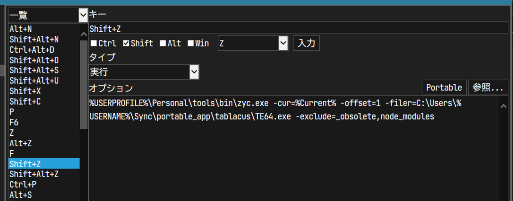

# fuzZY Childitem (files / directories) finder


```
> .\zyc.exe -h

  -all
        switch to search including file
  -cur string
        current directory
  -exclude string
        path to skip searching (comma-separated)
  -filer string
        filer (default "explorer.exe")
  -offset 0
        Specify the directory to start file traversing, by the number of layers from the current directory.
        `0` for the current directory, `1` for the parent directory, `2` for its parent directory, and so on.
        If this value is negative, the path is traversed back to the directory containing the file `.root`. If no `.root` file is found, the current directory is used as the root of the search. (default -1)
  -stdout
        switch to stdout
```


## With [Tablacus Explorer](https://tablacus.github.io/explorer.html).




---
enjoy!
